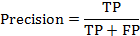

# paper-recommender
## 项目起源
本项目起源于写毕业论文时，导师说的推荐系统方向，就此入坑。
## 项目历史
本项目的项目结构起源于PredictionIO。因为PredictionIO需要安装集群环境，而且在集群环境下测试算法的指标，所需的计算机资源更多(因为穷，小破笔记本)。
集群环境下跑一次需要30分钟，到后面引入聚类等其他机器学习的算法，运行效果更慢。发现并不是大力出奇迹，而是算法决定效果。
所以为了更快的验证算法，特意参考了PredictionIO的部分源码，搭建的单机版的PredictionIO。

## 推荐系统相关问题
1. 在实践中，常常存在使用评分预测算法，来实现TopN推荐，其效果往往不尽如人意。Paolo Cremonesi在《Performance of Recommender Algorithms on Top-N Recommendation Tasks》(位于paper文件夹中)中，演示了预测评分的准确度指标均方根差(RMSE)与准确性指标(精确度/召回率)之间，不存在简单的线性关系，即评分预测的结果不适用与TopN推荐。
2. 在实现推荐算法中，往往注重于某一部分的算法，没有从全局进行考虑。例如，在生成物品推荐候选列表时，单纯考虑后期精确排序，没有考虑实际生产环境中推荐算法候选物品集的生成的问题，在为算法准备的候选集就是整个物品集。  
3. 存在数据捏造的问题。在注重实现某一部分的算法时，其数据构造与实际数据部分，造成结果不准确。例如，在生成候选集的基础上，把用户可能交互与不可能交互作为一个二分类任务。在构建测试数据集时，往往是正样例与负样例的数量是相等的(这是二分类算法在训练时，其特性决定的)。
4. 在实际生产中，用户与物品的数据集非常庞大。在基于内存的协同过滤推荐算法中，通过生成所有用户与用户或所有物品与物品之间的相似度矩阵，所需要的内存空间非常大，容易内存溢出。
5. 传统的协同过滤算法，在TopN推荐模式中精确度指标方面比较低，需要提高其精确度。  

## 项目的前置条件

1. 面向TopN领域，非评分预测领域。

2. 本论文中使用的数据集是[MovieLens](https://grouplens.org/datasets/movielens/)的MovieLens 100K 。使用其中的用户对电影的评分信息,位于u.data文件中。其数据格式为：用户ID、物品ID，评分和时间戳。  

3. 评测指标：        

   在本论文中使用这四个指标是基于一个假设，即：若用户喜欢这部推荐的电影，则会观看(点击)并评价(有评分信息)这部电影；若用户不喜欢(不点击)推荐的这部电影，则不会观看也不会评价(无评分信息)。

   推荐算法生成的结果，用户对其只有两种交互的可能性，即喜欢与不喜欢，是一个典型的二分类问题。推荐的电影与用户交互的结果有四种类别，如下表所示:

   | 真实情况 |         预测正例         |         预测反例         |
   | :------: | :----------------------: | :----------------------: |
   |   正例   | TP（预测为正，实际为正） | FN（预测为负，实际为正） |
   |   反例   | FP（预测为正，实际为负） | TN（预测为负，实际为负） |

   在本论文推荐算法生成的推荐列表中的电影，都代表预测结果为正例。因为预测结果为负例的电影，即用户不会看的电影，不会推荐给用户。预测结果中包含推荐后用户确实观看的电影(TP)，和推荐了但是没有观看的电影(FP)。而测试集中用户的电影列表都是真实情况的正例，其中包含被预测结果命中的正例(TP)和不包含在推荐列表中的反例(FN)。

   * 准确率       
   * 召回率     
   * F1分数      

4. 评测方法:

   本论文采用K折交叉验证法，先将原始数据集D划分为k个大小相似的互斥子集，即D=D1UD2UD3U...UDk 。按照划分顺序从中选择一个子集作为测试集，另外k-1个子集为训练集；即可得到k组训练集和测试集，最终返回这k组测试结果的均值，本论文中k的值为5。论文中相关电影的推荐列表长度为10，即TopN@10。

   主要验证步骤如下：

   1. 选择一个数据子集作为测试集。

   2. 对测试集中所有数据按照用户ID分组。

   3. 把用户的ID作为参数，调用预测的方法。

   4. 接收到模型生成的推荐列表后，与该用户所拥有的电影集合进行验证。

   5. 生成验证结果。

   6. 选择下一个数据子集，然后重复1-5，直到所有的数据集都被作为测试集。

   7. 最后返回所有测试组指标的均值作为最终结果。

## 程序架构

整个程序分为数据处理模块、训练模块、预测模块、评估模块。

1. 数据处理模块主要功能是从文件中读取数据，经过处理和分割，把数据传递给训练模块和评估模块。

2. 训练模块主要功能是使用训练数据训练模型，把训练好的模型传递给评估模块。

3. 模型中包含预测模块，对给出的用户生成指定长度推荐列表。

4. 评估模块主要功能是使用测试数据，调用模型的预测模块，获得推荐列表后，对列表中的电影与测试集中用户的电影进行对比验证，产生验证指标。

## 环境配置

1. 技术：Scala 2.11.12 + Spark 2.1.3 + DeepLearning4j  (详细看build.sbt文件中的内容)

2. 环境：IntelliJ IDEA 2018.3.2 (Community Edition)

## 项目结构介绍

其中src/main/scala/Recommender.scala是定义推荐算法必须实现的接口，其具体实现在src/main/scala/impl中。每个算法的介绍请在impl文件夹下查看，运行结果在result文件夹中。

## 主要工作
主要是改进了SAR算法，融合聚类协同算法，使其理论上可运行大量数据的平台。